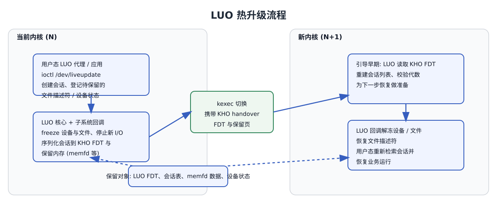

.. SPDX-License-Identifier: GPL-2.0

========================
Live Update Orchestrator
========================
:Author: Pasha Tatashin <pasha.tatashin@soleen.com>

.. kernel-doc:: kernel/liveupdate/luo_core.c
   :doc: Live Update Orchestrator (LUO)

热升级流程示意 / Hot upgrade flow
=================================

   LUO 热升级在 kexec 前冻结并序列化会话，随后在新内核中反序列化并解冻，用户态即可继续提供服务。
   LUO freezes/serializes sessions before kexec and unfreezes them in the next
   kernel so userspace can resume service quickly.

LUO Sessions
============
.. kernel-doc:: kernel/liveupdate/luo_session.c
   :doc: LUO Sessions

LUO Preserving File Descriptors
===============================
.. kernel-doc:: kernel/liveupdate/luo_file.c
   :doc: LUO File Descriptors

Live Update Orchestrator ABI
============================
.. kernel-doc:: include/linux/kho/abi/luo.h
   :doc: Live Update Orchestrator ABI

The following types of file descriptors can be preserved

.. toctree::
   :maxdepth: 1

   ../mm/memfd_preservation

Public API
==========
.. kernel-doc:: include/linux/liveupdate.h

.. kernel-doc:: include/linux/kho/abi/luo.h
   :functions:

.. kernel-doc:: kernel/liveupdate/luo_core.c
   :export:

.. kernel-doc:: kernel/liveupdate/luo_file.c
   :export:

Internal API
============
.. kernel-doc:: kernel/liveupdate/luo_core.c
   :internal:

.. kernel-doc:: kernel/liveupdate/luo_session.c
   :internal:

.. kernel-doc:: kernel/liveupdate/luo_file.c
   :internal:

See Also
========

- :doc:`Live Update uAPI </userspace-api/liveupdate>`
- :doc:`/core-api/kho/concepts`
